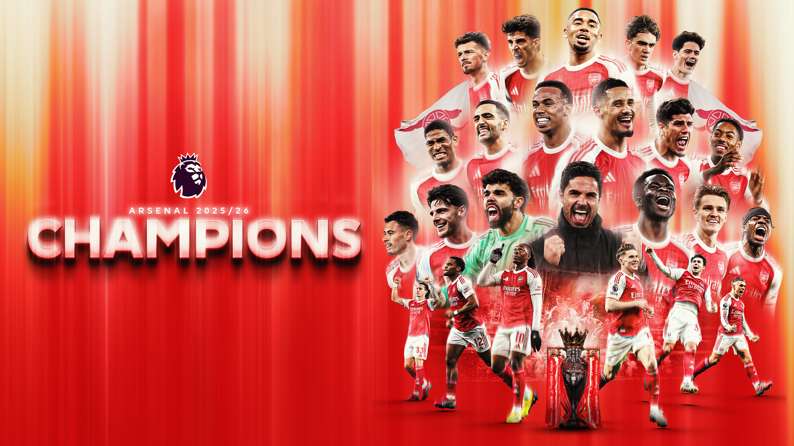
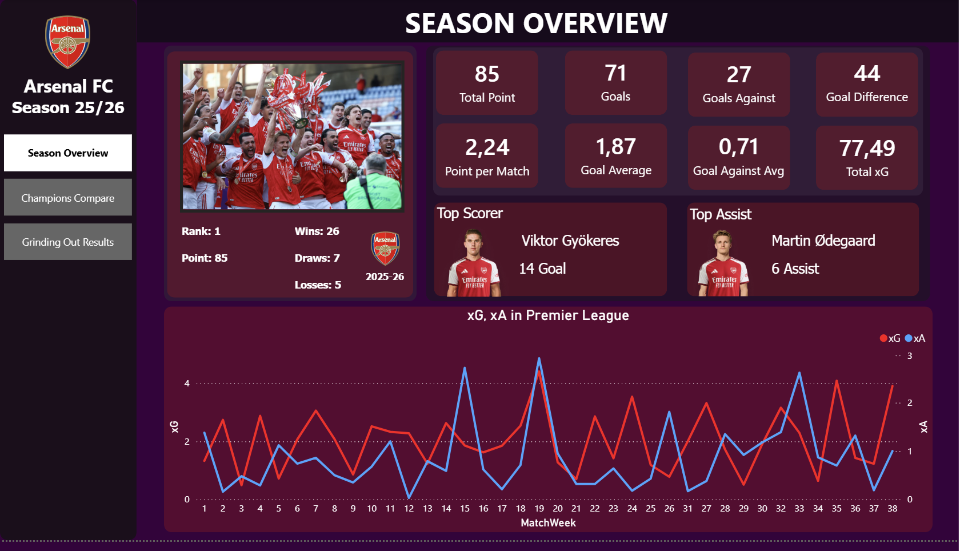
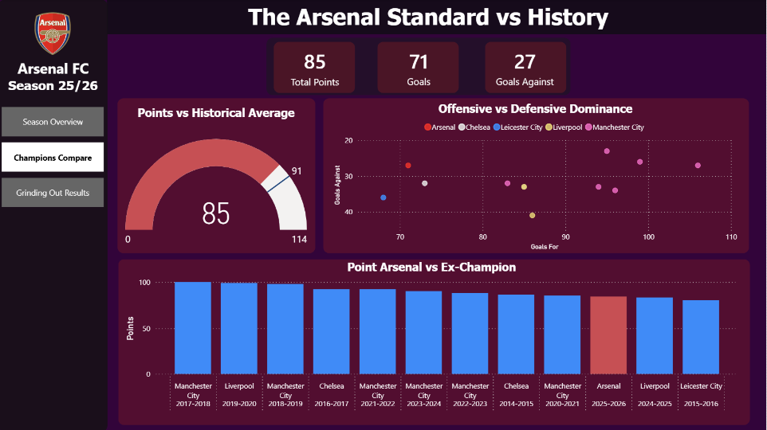
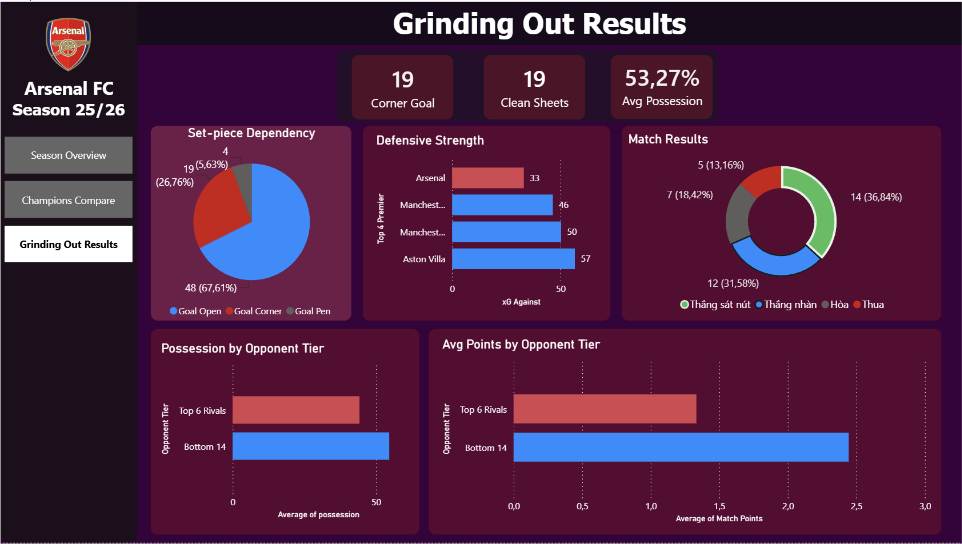

  

# BÁO CÁO PHÂN TÍCH: CHỨC VÔ ĐỊCH PREMIER LEAGUE 25/26 CỦA ARSENAL

## CÔNG NGHỆ & QUY TRÌNH DỮ LIỆU

Dự án này được xây dựng theo chuẩn quy trình **End-to-End Data Analytics**, từ khâu thu thập dữ liệu thô trên web cho đến thiết kế cơ sở dữ liệu và xây dựng bảng điều khiển (Dashboard) tương tác.

### 1. Nguồn dữ liệu 
*   **FBref:** Lấy toàn bộ dữ liệu thống kê chuyên sâu (Advanced Stats) bao gồm Standard Stats, Shooting, Goalkeeping, Playing Time, Miscellaneous Stats,... của Arsenal mùa giải 25/26 và dữ liệu của các nhà vô địch Premier League trong 10 năm gần nhất.

### 2. Công cụ Cào dữ liệu (Web Scraping)
*   **Ngôn ngữ:** Python 🐍
*   **Công nghệ:** Sử dụng thư viện `scrapling` (cụ thể là `StealthyFetcher`) để bypass cơ chế chống bot Cloudflare của FBref. Dữ liệu thô trên web được bóc tách và xuất ra các file định dạng JSON.

### 3. Lưu trữ & Quản trị Dữ liệu (Database)
*   **Hệ quản trị CSDL:** Microsoft SQL Server.
*   **Quy trình ETL:** Các script Python (`pyodbc`) tự động đọc file JSON, thực hiện làm sạch dữ liệu (chuẩn hóa tên, xử lý null/lỗi type) và Load vào Database. CSDL được thiết kế chặt chẽ theo mô hình quan hệ.

### 4. Trực quan hóa dữ liệu (Data Visualization)
*   **Công cụ:** Microsoft Power BI.
*   **Kỹ thuật:** Kết nối trực tiếp với SQL Server, xây dựng mô hình dữ liệu (Data Model), viết các biểu thức tính toán phân tích (DAX Measures), thiết kế UI/UX theo chủ đề "Emirates Night"

**Câu hỏi kinh doanh:** Những yếu tố nào khiến chức vô địch của Arsenal bị đánh giá thấp so với các nhà vô địch tiền nhiệm?

---

## TÓM TẮT

  

Mùa giải 2025/2026 chứng kiến Arsenal bước lên ngôi vương Premier League. Tuy nhiên, thay vì những lời tung hô về một "kỷ nguyên thống trị mới" thì giới chuyên môn lại đặt ra nhiều hoài nghi về sức mạnh thực sự của triều đại này. Dựa trên dữ liệu phân tích từ toàn bộ mùa giải, báo cáo này kết luận rằng chức vô địch của Arsenal bị đánh giá thấp là hoàn toàn có cơ sở dữ liệu chứng minh.

---

## PHÂN TÍCH CHI TIẾT

### 1. Điểm số và Sức mạnh Hàng công không ấn tượng

  

Yếu tố đầu tiên khiến Arsenal không được công nhận là một nhà vô địch vĩ đại nằm ở các chỉ số cơ bản.
*   **Điểm số thấp kỷ lục:** Xuyên suốt một thập kỷ qua, tiêu chuẩn vô địch do Man City và Liverpool thiết lập luôn nằm ở ngưỡng 90-100 điểm. Arsenal lên ngôi với vỏn vẹn **85 điểm**, biến họ thành nhà vô địch có số điểm thấp thứ hai trong lịch sử cận đại, chỉ xếp trên kỳ tích 81 điểm của Leicester City 15/16.
*   **Hàng công thiếu tính hủy diệt:** Biểu đồ *Offensive vs Defensive Dominance* đã cho thấy sự thật rằng hàng công của Arsenal không mang dáng dấp của nhà vô địch. Họ ghi được **71 bàn thắng**, tức trung bình 1.87 bàn/trận, đó không phải là chỉ số tệ nhưng nếu so với những nhà vô địch trước đây thì đây một con số mờ nhạt nếu đặt cạnh cột mốc 106 bàn của Man City 17/18. Vua phá lưới của họ là Gyokeres ghi được 14 bàn ở mùa giải đầu tiên anh chơi bóng cho Arsenal, nhưng nhìn vào những gì diễn ra trên sân thì anh ấy không phải là mối đe dọa với các hàng phòng ngự. Việc vô địch với số điểm và số bàn thắng thấp khiến dư luận cho rằng Arsenal đã "chớp thời cơ" trong một mùa giải mà các đối thủ lớn đều sa sút hơn là tự mình áp đảo giải đấu.

### 2. Ông lớn của những trận cầu nhỏ và Từ bỏ quyền Kiểm soát trước đối thủ lớn

  

Triết lý bóng đá đẹp của Arsenal dường như đã bị gạt bỏ để nhường chỗ cho sự thực dụng tột độ.
*   **Nhún nhường trước ông lớn:** Tỷ lệ cầm bóng trung bình cả mùa của họ chỉ đạt **53.27%** - một con số hiếm thấy ở các đội bóng thống trị. Đặc biệt, biểu đồ *Possession by Opponent Tier* cho chúng ta thấy khi đối đầu với nhóm Big 6, Arsenal hoàn toàn co cụm phòng thủ, nhường quyền kiểm soát bóng cho đối thủ. Họ kiếm điểm cực kỳ chật vật trước các đối thủ cạnh tranh trực tiếp với trung bình chỉ ~1.3 điểm/trận, cho thấy rằng phần lớn những trận đấu lớn thì sẽ thường Hòa và Thua.
*   **Cày điểm trước đội bóng nhỏ:** Chức vô địch của Arsenal được xây dựng dựa trên việc "bắt nạt" các đội bóng cửa dưới. Trước các đội yếu, họ dâng cao đội hình, áp đảo và thu về tối đa điểm số gần 2.5 điểm/trận. Sự thiếu dũng cảm trong các trận cầu lớn khiến chức vô địch của họ bị gán mác "thiếu bản lĩnh".

### 3. Sống sót nhờ Hàng phòng ngự vững chắc và Tình huống cố định
Do hàng công thiếu sáng tạo, Arsenal phải dựa dẫm hoàn toàn vào hệ thống phòng ngự và các tình huống cố định để giành chiến thắng.
*   **Bức tường thép:** Hàng phòng ngự của Arsenal đã có một mùa giải xuất sắc. Chỉ lọt lưới **27 bàn** và giữ sạch lưới tới **19 trận**. Đặc biệt, chỉ số Bàn thua kỳ vọng (xGA) của họ thấp nhất giải với 33 xGA, bỏ xa Man Utd 46 xGA hay Man City với 50 xGA. Điều này cho thấy hệ thống phòng ngự từ xa đã bóp nghẹt mọi cơ hội của đối thủ, không cho họ không gian dứt điểm.
*   **Vua "bóng chết":** Bức tranh toàn cảnh về mặt trận tấn công được thể hiện qua biểu đồ *Set-piece Dependency*. Arsenal ghi tới **19 bàn từ phạt góc** chiếm 26.76% tổng số bàn thắng. Tổng cộng có tới hơn 32% số bàn thắng đến từ các tình huống cố định bao gồm Bóng chết và Penalty. 
*   **Những chiến thắng thót tim:** Việc phụ thuộc quá nhiều vào những tình huống cố định cho thấy họ gặp bế tắc với bóng sống. Hệ quả của việc này là Arsenal có tới **14 trận thắng sát nút** (cách biệt 1 bàn) và 7 trận hòa. Họ đã phải nhọc nhằn giành từng kết quả một thay vì những chiến thắng hủy diệt 3-0 hay 4-0.

---

## KẾT LUẬN & ĐỀ XUẤT

**Kết luận:** 
Việc chức vô địch của Arsenal bị đánh giá thấp là hoàn toàn dễ hiểu khi đối chiếu với dữ liệu lịch sử. Tuy nhiên, không thể phủ nhận sự xuất sắc trong khâu tổ chức chiến thuật đặc biệt là hàng thủ và bài vở phạt góc của HLV Mikel Arteta.

**Đề xuất hành động:**
Mô hình "nhà vô địch thực dụng" này tiềm ẩn rủi ro cực lớn. Khi các đối thủ tìm ra cách hóa giải các pha phạt góc, hàng thủ sa sút phong độ hay các trụ cột chấn thương, Arsenal sẽ lập tức sụp đổ vì không có phương án B. 
Để bảo vệ ngôi vương ở mùa giải tới, Ban Lãnh Đạo Arsenal **BẮT BUỘC phải chi đậm trên Thị trường Chuyển nhượng**:
1. Cần mua gấp một **Tiền vệ Sáng tạo** đủ đẳng cấp để phá vỡ các khối phòng ngự lùi sâu vừa san sẻ gánh nặng cho Odegaard.
2. Cần một **Tiền đạo Cắm** có khả năng tự làm bàn xuất chúng để cải thiện triệt để số lượng bàn thắng từ bóng sống, giúp đội bóng kết liễu trận đấu sớm thay vì phải phòng ngự thót tim trong những phút cuối.
3. Cần có phương án Backup đủ chất lượng cho Saliba và Gabriel khi 1 trong 2 hoặc cả 2 cầu thủ này không có mặt trên sân.

---

